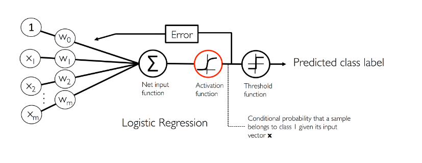

## 前言  
這篇主要是用R實現[ch03](https://github.com/renardbao/ML_learn/blob/master/ml_learning_ch03.ipynb)裡梯度下降法邏輯式迴歸。  

梯度下降法邏輯式迴歸概念圖:
  

透過Net input function 進行資料和權重的內積計算，再透過Activation function將線性處理轉成非線性，然後根據計算出來的機率和原始資料相減計算誤差並更新權重，最後透過Threshold function預測資料。  

***

## LogisticRegressionGD  
R實現梯度下降法邏輯式迴歸`LogisticRegressionGD`，演算法中我也實現了線上更新模型(修改模型):  
```{r LogisticRegressionGD}
#機器學習--梯度下降法邏輯式迴歸
LogisticRegressionGD <- function(data,y,
                                 type = 'train',
                                 w = NULL,
                                 eta = 0.05,
                                 n_iter = 100,
                                 seed = 1){
  #計算淨輸入
  net_input = function(x,w){
    return(x %*% w[2:length(w)] + w[1])
  }
  #邏輯啟動函數
  sigmod = function(x){
    x[x > 250] = 250
    x[x < -250] = -250
    return(1/(1 + exp(-x)))
  } 
  #訓練模型
  fit = function( data,y,
                  eta = 0.05,
                  n_iter = 100,
                  seed ){
    set.seed(seed)
    #隨機起始權重
    w = rnorm(ncol(data) + 1 ,mean = 0,sd = 0.01)
    #儲存每輪計算的成本
    cost = vector()
    #迭代次數
    for (i in 1:n_iter) {
      #計算淨輸入(向量特徵x與權重w的內積)
      net_input_value = net_input(data,w)
      #啟動函數,給定淨輸入計算屬於類別1的機率
      output = sigmod(net_input_value)
      #計算這輪誤差
      errors = (y - output)
      #將誤差和原始資料的轉置矩陣做內積(將每筆資料的特徵都和各自誤差相乘然後相加)進行權重更新
      w[2:length(w)] = w[2:length(w)] + eta * t(data) %*% errors
      #偏誤單元(bias unit)可以參考這篇https://stackoverflow.com/questions/2480650/role-of-bias-in-neural-networks
      w[1] = w[1] + eta * sum(errors)
      #邏輯式迴歸的損失函數
      cost_value = (-1 * (y %*% log(output))) - ((1-y) %*% log(1- output))
      cost = c(cost,cost_value)
    }
    return(list(w = w,cost = cost))
  }
  
  
  predict = function(data,w){
    predict_z = as.vector(sigmod(net_input(data,w)))
    predict_label = as.vector(ifelse(predict_z >= 0.5,1,0))
    return(list(z = predict_z,label = predict_label))
  }
  data <- as.matrix(data)
  y <- as.numeric(y)
  #訓練模型
  if(type == 'train'){
   fit_ = fit(data,y,eta = eta,seed=seed,n_iter = n_iter)
   predict_ = predict(data,fit_$w)
    }else if(type == 'predict'){ #直接預測
      if(is.null(w)){
        fit_ = fit(data,y,eta = eta,seed=seed)
        predict_ = predict(data,fit_$w)
      }else{
       #已經有train好的w
        predict_ = predict(data,w)
      }
    }
  #回傳值
  if(type == 'train'){
    return(list(
      weight = fit_$w,
      cost = fit_$cost,
      #預測的機率
      beta = predict_$z,
      label = predict_$label,
      accuracy = prop.table(table(predict_$label == y))[['TRUE']]
    ))
  }else if(type == 'predict'){
    return(list(
      weight = w,
      cost = NULL,
      beta = predict_$z,
      label = predict_$label,
      accuracy = prop.table(table(predict_$label == y))[['TRUE']]
    ))
  }
    
}

```

***

## 資料分割函數

手動寫一個將資料分割成訓練用跟測試用的函數  


```{r data_split}
#手動寫一個將資料分割成訓練用跟測試用
data_split <- function(data,split_f,train_percent = 0.7){
  splited = split(data,data[,split_f])
  train <- data.frame()
  test <- data.frame()
  for (i in 1:length(splited)) {
    n = nrow(splited[[i]])
    set.seed(1)
    data_new = splited[[i]][sample(1:n,n),]
    train_n = ceiling(train_percent * n)
    train = rbind(train,data_new[1:train_n,])
    test = rbind(test,data_new[(train_n+1):n,])
  }
  set.seed(1)
  return(list(train = train[sample(1:nrow(train),nrow(train)),],
              test = test[sample(1:nrow(test),nrow(test)),]))
}

```

***

## iris 

運用iris測試我剛剛寫好的邏輯式迴歸  

```{r iris}
iris_data <- iris
iris_data$Species <- as.numeric(iris_data$Species) -1
iris_data <- data_split(iris_data,'Species',0.7)
train <- iris_data$train
test <- iris_data$test

print(table(iris$Species))
print(table(train$Species))
print(table(test$Species))

#實作演練的演算法只能分類兩個目標變數
train1_x <- train[train$Species == 0 | train$Species == 1,c(1,3)]
train1_y <- train[train$Species == 0 | train$Species == 1,5]

test1_x <- test[test$Species == 0 | test$Species == 1,c(1,3)]
test1_y <- test[test$Species == 0 | test$Species == 1,5]


iris_logistic <- LogisticRegressionGD(train1_x,train1_y,eta=0.01)
#訓練集的準確率
iris_logistic$accuracy
iris_logistic_test <- LogisticRegressionGD(test1_x,
                                           test1_y,
                                           type = 'predict',
                                           w = iris_logistic$weight )
#測試集的準確率
iris_logistic_test$accuracy
#觀察分類器收斂情況
library(ggplot2)
ggplot(data.frame(cost = iris_logistic$cost,
       poch = 1:length(iris_logistic$cost))) + 
  geom_line(aes(y = cost,x = poch))


```

我的分類器大概在第10還是第11次就開始收斂，但是前面還在震盪尋找向下的坡度，可能跟資料沒有標準化或式學習速率過高有關。

```{r iris2}
#將學習速率調低
iris_logistic <- LogisticRegressionGD(train1_x,train1_y,
                                      n_iter = 1000,eta=0.001)
ggplot(data.frame(cost = iris_logistic$cost,
       poch = 1:length(iris_logistic$cost))) + 
  geom_line(aes(y = cost,x = poch))


iris_data <- iris
iris_data$Species <- as.numeric(iris_data$Species) -1
iris_data[,1:3] <- apply(iris_data[,1:3],2,scale)
iris_data <- data_split(iris_data,'Species',0.7)
train <- iris_data$train
test <- iris_data$test
train1_x <- train[train$Species == 0 | train$Species == 1,c(1,3)]
train1_y <- train[train$Species == 0 | train$Species == 1,5]
test1_x <- test[test$Species == 0 | test$Species == 1,c(1,3)]
test1_y <- test[test$Species == 0 | test$Species == 1,5]

#將特徵標準化後
iris_logistic <- LogisticRegressionGD(train1_x,train1_y,eta=0.01)
ggplot(data.frame(cost = iris_logistic$cost,
       poch = 1:length(iris_logistic$cost))) + 
  geom_line(aes(y = cost,x = poch))

```

***

## 威斯康辛州的乳癌資料集

運用著名的威斯康辛州的乳癌資料集來測試邏輯式迴歸演算法:

```{r wdbc}
###威斯康辛州的乳癌資料集
wdbc <- read.table("data/wdbc.data",sep = ',')
var <- c('radius','texture','perimeter','area','smoothness',
         'compactness','concavity','concave_points',
         'symmetry','fractal_dimension')
names(wdbc) <- c('id','diagnosis',paste0(var,c(rep('_mean',10),
                                               rep('_std',10),
                                               rep('_worst',10))))
#B = 0,M = 1
wdbc$diagnosis <- as.numeric(wdbc$diagnosis) -1 
wdbc[,3:ncol(wdbc)] <- apply(wdbc[,3:ncol(wdbc)],2,scale)
wdbc_data <- data_split(wdbc,'diagnosis',train_percent = 0.7)
wdbc_train <- wdbc_data$train[,c(2,27,10,30,31,29,9,23,24)]
#抽取的特徵
names(wdbc_train)
wdbc_test <- wdbc_data$test[,c(2,27,10,30,31,29,9,23,24)]

train1_x <- wdbc_train[,-1]
train1_y <- wdbc_train[,1]

test1_x <- wdbc_test[,-1]
test1_y <- wdbc_test[,1]


wdbc_logistic <- LogisticRegressionGD(train1_x,train1_y,
                                      n_iter = 100,eta=0.001)
#訓練集的準確率
wdbc_logistic$accuracy
wdbc_logistic_test <- LogisticRegressionGD(test1_x,
                                           test1_y,
                                           type = 'predict',
                                           w = wdbc_logistic$weight )
#測試集的準確率
wdbc_logistic_test$accuracy

#觀察分類器收斂情況
ggplot(data.frame(cost = wdbc_logistic$cost,
                  poch = 1:length(wdbc_logistic$cost))) + 
  geom_line(aes(y = cost,x = poch))

```


