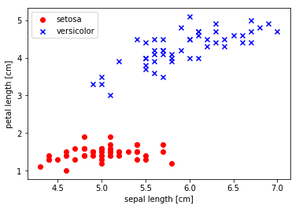
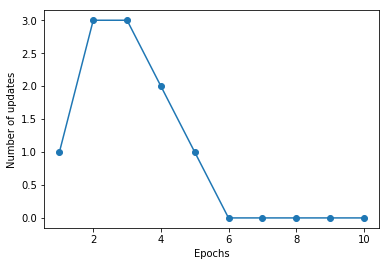
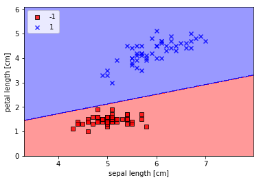
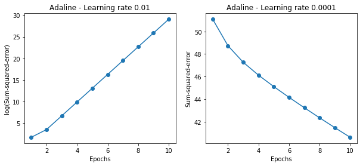
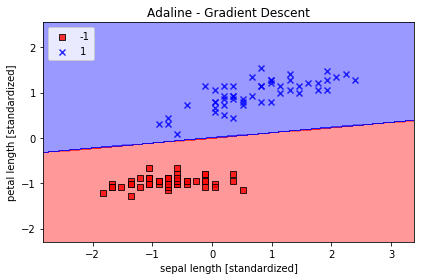
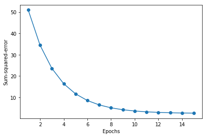
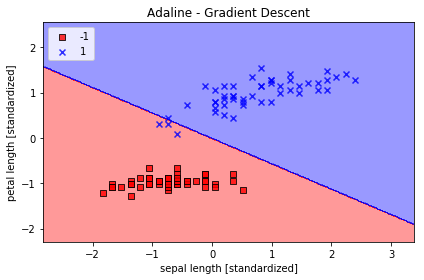
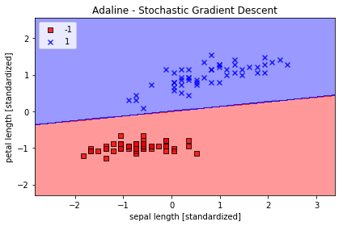
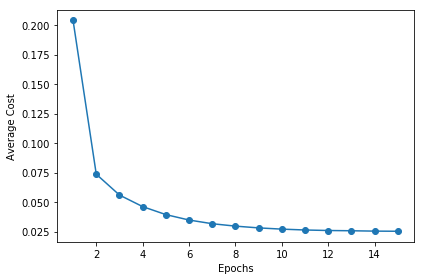

# 實作感知器-Iris data-set


```python
import numpy as np 

class  Perceptron(object):
    """Perceptron classifier.#感知器
    Parameters
    ------------
    eta : float 學習速率 ( 0 ~ 1.0)
    n_iter : int 迭代次數
    random_state : int 初始化的隨機種子

    Attributes
    -----------
    w_ : 1d-array 配適過後的權重向量
    errors_ : list 儲存每輪的錯誤分類
    """
    def __init__(self,eta=0.01, n_iter = 50,random_state = 1):
        self.eta = eta
        self.n_iter = n_iter
        self.random_state = random_state
    def fit(self,X,y):
        """Fit training data.

        Parameters
        ----------
        X : {array-like}, shape = [n_samples, n_features]
          訓練用的向量,n_samples : 樣本數
          n_features : 特徵數.
        y : array-like, shape = [n_samples]
          目標變數.
        -------
        self : object

        """
        rgen = np.random.RandomState(self.random_state)
        #設定隨機種子
        #class裡面最好用 RandomState這種物件化來讓程式保持彈性                                                   
        self.w_ = rgen.normal(loc=0.0, scale=0.01, size=1 + X.shape[1])
        #亂數產生符合常態分布的隨機矩陣
        self.errors_ = []
        for _ in range(self.n_iter): #_是隨便一個不關心的變量(非約定俗成)
            errors = 0
            for xi, target in zip(X, y):
                update = self.eta * (target - self.predict(xi))
                self.w_[1:] += update * xi
                self.w_[0] += update    #誤差項常數(偏誤單元)
                errors += int(update != 0.0)
            self.errors_.append(errors)
        return self
    def net_input(self, X):
        """Calculate net input"""
        return np.dot(X, self.w_[1:]) + self.w_[0]
    #np.dot 矩陣點積

    def predict(self, X):
        """Return class label after unit step"""
        return np.where(self.net_input(X) >= 0.0, 1, -1)
 
```


```python
import pandas as pd

df = pd.read_csv('https://archive.ics.uci.edu/ml/'
        'machine-learning-databases/iris/iris.data', header=None)
df.tail()
```


<div>
<style scoped>
    .dataframe tbody tr th:only-of-type {
        vertical-align: middle;
    }

    .dataframe tbody tr th {
        vertical-align: top;
    }

    .dataframe thead th {
        text-align: right;
    }
</style>
<table border="1" class="dataframe">
  <thead>
    <tr style="text-align: right;">
      <th></th>
      <th>0</th>
      <th>1</th>
      <th>2</th>
      <th>3</th>
      <th>4</th>
    </tr>
  </thead>
  <tbody>
    <tr>
      <th>145</th>
      <td>6.7</td>
      <td>3.0</td>
      <td>5.2</td>
      <td>2.3</td>
      <td>Iris-virginica</td>
    </tr>
    <tr>
      <th>146</th>
      <td>6.3</td>
      <td>2.5</td>
      <td>5.0</td>
      <td>1.9</td>
      <td>Iris-virginica</td>
    </tr>
    <tr>
      <th>147</th>
      <td>6.5</td>
      <td>3.0</td>
      <td>5.2</td>
      <td>2.0</td>
      <td>Iris-virginica</td>
    </tr>
    <tr>
      <th>148</th>
      <td>6.2</td>
      <td>3.4</td>
      <td>5.4</td>
      <td>2.3</td>
      <td>Iris-virginica</td>
    </tr>
    <tr>
      <th>149</th>
      <td>5.9</td>
      <td>3.0</td>
      <td>5.1</td>
      <td>1.8</td>
      <td>Iris-virginica</td>
    </tr>
  </tbody>
</table>
</div>


```python
%matplotlib inline
import matplotlib.pyplot as plt
import numpy as np

# select setosa and versicolor
y = df.iloc[0:100, 4].values
y = np.where(y == 'Iris-setosa', -1, 1)

# extract sepal length and petal length
X = df.iloc[0:100, [0, 2]].values

# plot data
plt.scatter(X[:50, 0], X[:50, 1],
            color='red', marker='o', label='setosa')
plt.scatter(X[50:100, 0], X[50:100, 1],
            color='blue', marker='x', label='versicolor')

plt.xlabel('sepal length [cm]')
plt.ylabel('petal length [cm]')
plt.legend(loc='upper left')

# plt.savefig('images/02_06.png', dpi=300)
plt.show()
```





```python
for i,m,l in zip(X,y,range(10)):
        print(i,m)
#看一下iris頭10筆資料
```

    [5.1 1.4] -1
    [4.9 1.4] -1
    [4.7 1.3] -1
    [4.6 1.5] -1
    [5.  1.4] -1
    [5.4 1.7] -1
    [4.6 1.4] -1
    [5.  1.5] -1
    [4.4 1.4] -1
    [4.9 1.5] -1
    

## 感知器運作軌跡(讓自己更了解運作原理)


```python
rgen = np.random.RandomState(1)
#初始權重
w = rgen.normal(loc = 0,scale = 0.01,size =  1+X.shape[1])
print('初始權重')
print(w)
# 第一次更新權重
for i in range(2):
    print('####################第' + str(i+1) + '輪####################')
    count = 0
    for xi ,target in zip(X,y):
        count += 1
        print('第',str(count),'筆資料')
        print('x value:',xi)
        net_input =  np.dot(xi,w[1:]) + w[0]
        print('運算內積:',net_input)
        predict = np.where(net_input >= 0 ,1,-1)
        print('預測:',predict)
        update = 0.01 * (target - predict)
        print('更新權重:如果預測對,更新後的權重不變')
        print('更新權重:',update)
        w[1:] += update * xi
        w[0] += update
        print('更新後權重',w)

```

    初始權重
    [ 0.01624345 -0.00611756 -0.00528172]
    ####################第1輪####################
    第 1 筆資料
    x value: [5.1 1.4]
    運算內積: -0.022350527991209804
    預測: -1
    更新權重:如果預測對,更新後的權重不變
    更新權重: 0.0
    更新後權重 [ 0.01624345 -0.00611756 -0.00528172]
    第 2 筆資料
    x value: [4.9 1.4]
    運算內積: -0.021127015163909656
    預測: -1
    更新權重:如果預測對,更新後的權重不變
    更新權重: 0.0
    更新後權重 [ 0.01624345 -0.00611756 -0.00528172]
    第 3 筆資料
    x value: [4.7 1.3]
    運算內積: -0.019375330584346054
    預測: -1
    更新權重:如果預測對,更新後的權重不變
    更新權重: 0.0
    更新後權重 [ 0.01624345 -0.00611756 -0.00528172]
    第 4 筆資料
    x value: [4.6 1.5]
    運算內積: -0.019819917675222884
    預測: -1
    更新權重:如果預測對,更新後的權重不變
    更新權重: 0.0
    更新後權重 [ 0.01624345 -0.00611756 -0.00528172]
    第 5 筆資料
    x value: [5.  1.4]
    運算內積: -0.021738771577559733
    預測: -1
    更新權重:如果預測對,更新後的權重不變
    更新權重: 0.0
    更新後權重 [ 0.01624345 -0.00611756 -0.00528172]
    第 6 筆資料
    x value: [5.4 1.7]
    運算內積: -0.025770312488950405
    預測: -1
    更新權重:如果預測對,更新後的權重不變
    更新權重: 0.0
    更新後權重 [ 0.01624345 -0.00611756 -0.00528172]
    第 7 筆資料
    x value: [4.6 1.4]
    運算內積: -0.01929174592295943
    預測: -1
    更新權重:如果預測對,更新後的權重不變
    更新權重: 0.0
    更新後權重 [ 0.01624345 -0.00611756 -0.00528172]
    第 8 筆資料
    x value: [5.  1.5]
    運算內積: -0.022266943329823187
    預測: -1
    更新權重:如果預測對,更新後的權重不變
    更新權重: 0.0
    更新後權重 [ 0.01624345 -0.00611756 -0.00528172]
    第 9 筆資料
    x value: [4.4 1.4]
    運算內積: -0.018068233095659282
    預測: -1
    更新權重:如果預測對,更新後的權重不變
    更新權重: 0.0
    更新後權重 [ 0.01624345 -0.00611756 -0.00528172]
    第 10 筆資料
    x value: [4.9 1.5]
    運算內積: -0.021655186916173116
    預測: -1
    更新權重:如果預測對,更新後的權重不變
    更新權重: 0.0
    更新後權重 [ 0.01624345 -0.00611756 -0.00528172]
    第 11 筆資料
    x value: [5.4 1.5]
    運算內積: -0.02471396898442349
    預測: -1
    更新權重:如果預測對,更新後的權重不變
    更新權重: 0.0
    更新後權重 [ 0.01624345 -0.00611756 -0.00528172]
    第 12 筆資料
    x value: [4.8 1.6]
    運算內積: -0.021571602254786493
    預測: -1
    更新權重:如果預測對,更新後的權重不變
    更新權重: 0.0
    更新後權重 [ 0.01624345 -0.00611756 -0.00528172]
    第 13 筆資料
    x value: [4.8 1.4]
    運算內積: -0.020515258750259578
    預測: -1
    更新權重:如果預測對,更新後的權重不變
    更新權重: 0.0
    更新後權重 [ 0.01624345 -0.00611756 -0.00528172]
    第 14 筆資料
    x value: [4.3 1.1]
    運算內積: -0.015871961425218836
    預測: -1
    更新權重:如果預測對,更新後的權重不變
    更新權重: 0.0
    更新後權重 [ 0.01624345 -0.00611756 -0.00528172]
    第 15 筆資料
    x value: [5.8 1.2]
    運算內積: -0.025576479382233418
    預測: -1
    更新權重:如果預測對,更新後的權重不變
    更新權重: 0.0
    更新後權重 [ 0.01624345 -0.00611756 -0.00528172]
    第 16 筆資料
    x value: [5.7 1.5]
    運算內積: -0.026549238225373716
    預測: -1
    更新權重:如果預測對,更新後的權重不變
    更新權重: 0.0
    更新後權重 [ 0.01624345 -0.00611756 -0.00528172]
    第 17 筆資料
    x value: [5.4 1.3]
    運算內積: -0.023657625479896582
    預測: -1
    更新權重:如果預測對,更新後的權重不變
    更新權重: 0.0
    更新後權重 [ 0.01624345 -0.00611756 -0.00528172]
    第 18 筆資料
    x value: [5.1 1.4]
    運算內積: -0.022350527991209804
    預測: -1
    更新權重:如果預測對,更新後的權重不變
    更新權重: 0.0
    更新後權重 [ 0.01624345 -0.00611756 -0.00528172]
    第 19 筆資料
    x value: [5.7 1.7]
    運算內積: -0.02760558172990063
    預測: -1
    更新權重:如果預測對,更新後的權重不變
    更新權重: 0.0
    更新後權重 [ 0.01624345 -0.00611756 -0.00528172]
    第 20 筆資料
    x value: [5.1 1.5]
    運算內積: -0.022878699743473258
    預測: -1
    更新權重:如果預測對,更新後的權重不變
    更新權重: 0.0
    更新後權重 [ 0.01624345 -0.00611756 -0.00528172]
    第 21 筆資料
    x value: [5.4 1.7]
    運算內積: -0.025770312488950405
    預測: -1
    更新權重:如果預測對,更新後的權重不變
    更新權重: 0.0
    更新後權重 [ 0.01624345 -0.00611756 -0.00528172]
    第 22 筆資料
    x value: [5.1 1.5]
    運算內積: -0.022878699743473258
    預測: -1
    更新權重:如果預測對,更新後的權重不變
    更新權重: 0.0
    更新後權重 [ 0.01624345 -0.00611756 -0.00528172]
    第 23 筆資料
    x value: [4.6 1. ]
    運算內積: -0.017179058913905608
    預測: -1
    更新權重:如果預測對,更新後的權重不變
    更新權重: 0.0
    更新後權重 [ 0.01624345 -0.00611756 -0.00528172]
    第 24 筆資料
    x value: [5.1 1.7]
    運算內積: -0.023935043248000172
    預測: -1
    更新權重:如果預測對,更新後的權重不變
    更新權重: 0.0
    更新後權重 [ 0.01624345 -0.00611756 -0.00528172]
    第 25 筆資料
    x value: [4.8 1.9]
    運算內積: -0.02315611751157686
    預測: -1
    更新權重:如果預測對,更新後的權重不變
    更新權重: 0.0
    更新後權重 [ 0.01624345 -0.00611756 -0.00528172]
    第 26 筆資料
    x value: [5.  1.6]
    運算內積: -0.022795115082086648
    預測: -1
    更新權重:如果預測對,更新後的權重不變
    更新權重: 0.0
    更新後權重 [ 0.01624345 -0.00611756 -0.00528172]
    第 27 筆資料
    x value: [5.  1.6]
    運算內積: -0.022795115082086648
    預測: -1
    更新權重:如果預測對,更新後的權重不變
    更新權重: 0.0
    更新後權重 [ 0.01624345 -0.00611756 -0.00528172]
    第 28 筆資料
    x value: [5.2 1.5]
    運算內積: -0.023490456157123342
    預測: -1
    更新權重:如果預測對,更新後的權重不變
    更新權重: 0.0
    更新後權重 [ 0.01624345 -0.00611756 -0.00528172]
    第 29 筆資料
    x value: [5.2 1.4]
    運算內積: -0.022962284404859888
    預測: -1
    更新權重:如果預測對,更新後的權重不變
    更新權重: 0.0
    更新後權重 [ 0.01624345 -0.00611756 -0.00528172]
    第 30 筆資料
    x value: [4.7 1.6]
    運算內積: -0.020959845841136415
    預測: -1
    更新權重:如果預測對,更新後的權重不變
    更新權重: 0.0
    更新後權重 [ 0.01624345 -0.00611756 -0.00528172]
    第 31 筆資料
    x value: [4.8 1.6]
    運算內積: -0.021571602254786493
    預測: -1
    更新權重:如果預測對,更新後的權重不變
    更新權重: 0.0
    更新後權重 [ 0.01624345 -0.00611756 -0.00528172]
    第 32 筆資料
    x value: [5.4 1.5]
    運算內積: -0.02471396898442349
    預測: -1
    更新權重:如果預測對,更新後的權重不變
    更新權重: 0.0
    更新後權重 [ 0.01624345 -0.00611756 -0.00528172]
    第 33 筆資料
    x value: [5.2 1.5]
    運算內積: -0.023490456157123342
    預測: -1
    更新權重:如果預測對,更新後的權重不變
    更新權重: 0.0
    更新後權重 [ 0.01624345 -0.00611756 -0.00528172]
    第 34 筆資料
    x value: [5.5 1.4]
    運算內積: -0.024797553645810114
    預測: -1
    更新權重:如果預測對,更新後的權重不變
    更新權重: 0.0
    更新後權重 [ 0.01624345 -0.00611756 -0.00528172]
    第 35 筆資料
    x value: [4.9 1.5]
    運算內積: -0.021655186916173116
    預測: -1
    更新權重:如果預測對,更新後的權重不變
    更新權重: 0.0
    更新後權重 [ 0.01624345 -0.00611756 -0.00528172]
    第 36 筆資料
    x value: [5.  1.2]
    運算內積: -0.02068242807303282
    預測: -1
    更新權重:如果預測對,更新後的權重不變
    更新權重: 0.0
    更新後權重 [ 0.01624345 -0.00611756 -0.00528172]
    第 37 筆資料
    x value: [5.5 1.3]
    運算內積: -0.02426938189354666
    預測: -1
    更新權重:如果預測對,更新後的權重不變
    更新權重: 0.0
    更新後權重 [ 0.01624345 -0.00611756 -0.00528172]
    第 38 筆資料
    x value: [4.9 1.5]
    運算內積: -0.021655186916173116
    預測: -1
    更新權重:如果預測對,更新後的權重不變
    更新權重: 0.0
    更新後權重 [ 0.01624345 -0.00611756 -0.00528172]
    第 39 筆資料
    x value: [4.4 1.3]
    運算內積: -0.01754006134339583
    預測: -1
    更新權重:如果預測對,更新後的權重不變
    更新權重: 0.0
    更新後權重 [ 0.01624345 -0.00611756 -0.00528172]
    第 40 筆資料
    x value: [5.1 1.5]
    運算內積: -0.022878699743473258
    預測: -1
    更新權重:如果預測對,更新後的權重不變
    更新權重: 0.0
    更新後權重 [ 0.01624345 -0.00611756 -0.00528172]
    第 41 筆資料
    x value: [5.  1.3]
    運算內積: -0.02121059982529628
    預測: -1
    更新權重:如果預測對,更新後的權重不變
    更新權重: 0.0
    更新後權重 [ 0.01624345 -0.00611756 -0.00528172]
    第 42 筆資料
    x value: [4.5 1.3]
    運算內積: -0.0181518177570459
    預測: -1
    更新權重:如果預測對,更新後的權重不變
    更新權重: 0.0
    更新後權重 [ 0.01624345 -0.00611756 -0.00528172]
    第 43 筆資料
    x value: [4.4 1.3]
    運算內積: -0.01754006134339583
    預測: -1
    更新權重:如果預測對,更新後的權重不變
    更新權重: 0.0
    更新後權重 [ 0.01624345 -0.00611756 -0.00528172]
    第 44 筆資料
    x value: [5.  1.6]
    運算內積: -0.022795115082086648
    預測: -1
    更新權重:如果預測對,更新後的權重不變
    更新權重: 0.0
    更新後權重 [ 0.01624345 -0.00611756 -0.00528172]
    第 45 筆資料
    x value: [5.1 1.9]
    運算內積: -0.024991386752527087
    預測: -1
    更新權重:如果預測對,更新後的權重不變
    更新權重: 0.0
    更新後權重 [ 0.01624345 -0.00611756 -0.00528172]
    第 46 筆資料
    x value: [4.8 1.4]
    運算內積: -0.020515258750259578
    預測: -1
    更新權重:如果預測對,更新後的權重不變
    更新權重: 0.0
    更新後權重 [ 0.01624345 -0.00611756 -0.00528172]
    第 47 筆資料
    x value: [5.1 1.6]
    運算內積: -0.02340687149573672
    預測: -1
    更新權重:如果預測對,更新後的權重不變
    更新權重: 0.0
    更新後權重 [ 0.01624345 -0.00611756 -0.00528172]
    第 48 筆資料
    x value: [4.6 1.4]
    運算內積: -0.01929174592295943
    預測: -1
    更新權重:如果預測對,更新後的權重不變
    更新權重: 0.0
    更新後權重 [ 0.01624345 -0.00611756 -0.00528172]
    第 49 筆資料
    x value: [5.3 1.5]
    運算內積: -0.024102212570773413
    預測: -1
    更新權重:如果預測對,更新後的權重不變
    更新權重: 0.0
    更新後權重 [ 0.01624345 -0.00611756 -0.00528172]
    第 50 筆資料
    x value: [5.  1.4]
    運算內積: -0.021738771577559733
    預測: -1
    更新權重:如果預測對,更新後的權重不變
    更新權重: 0.0
    更新後權重 [ 0.01624345 -0.00611756 -0.00528172]
    第 51 筆資料
    x value: [7.  4.7]
    運算內積: -0.05140356767525528
    預測: -1
    更新權重:如果預測對,更新後的權重不變
    更新權重: 0.02
    更新後權重 [0.03624345 0.13388244 0.08871828]
    第 52 筆資料
    x value: [6.4 4.5]
    運算內積: 1.2923233143111723
    預測: 1
    更新權重:如果預測對,更新後的權重不變
    更新權重: 0.0
    更新後權重 [0.03624345 0.13388244 0.08871828]
    第 53 筆資料
    x value: [6.9 4.9]
    運算內積: 1.394751845233868
    預測: 1
    更新權重:如果預測對,更新後的權重不變
    更新權重: 0.0
    更新後權重 [0.03624345 0.13388244 0.08871828]
    第 54 筆資料
    x value: [5.5 4. ]
    運算內積: 1.1274699807953403
    預測: 1
    更新權重:如果預測對,更新後的權重不變
    更新權重: 0.0
    更新後權重 [0.03624345 0.13388244 0.08871828]
    第 55 筆資料
    x value: [6.5 4.6]
    運算內積: 1.3145833861452587
    預測: 1
    更新權重:如果預測對,更新後的權重不變
    更新權重: 0.0
    更新後權重 [0.03624345 0.13388244 0.08871828]
    第 56 筆資料
    x value: [5.7 4.5]
    運算內積: 1.198605609206723
    預測: 1
    更新權重:如果預測對,更新後的權重不變
    更新權重: 0.0
    更新後權重 [0.03624345 0.13388244 0.08871828]
    第 57 筆資料
    x value: [6.3 4.7]
    運算內積: 1.2966787272202955
    預測: 1
    更新權重:如果預測對,更新後的權重不變
    更新權重: 0.0
    更新後權重 [0.03624345 0.13388244 0.08871828]
    第 58 筆資料
    x value: [4.9 3.3]
    運算內積: 0.9850377215430849
    預測: 1
    更新權重:如果預測對,更新後的權重不變
    更新權重: 0.0
    更新後權重 [0.03624345 0.13388244 0.08871828]
    第 59 筆資料
    x value: [6.6 4.6]
    運算內積: 1.3279716297316086
    預測: 1
    更新權重:如果預測對,更新後的權重不變
    更新權重: 0.0
    更新後權重 [0.03624345 0.13388244 0.08871828]
    第 60 筆資料
    x value: [5.2 3.9]
    運算內積: 1.0784334217885538
    預測: 1
    更新權重:如果預測對,更新後的權重不變
    更新權重: 0.0
    更新後權重 [0.03624345 0.13388244 0.08871828]
    第 61 筆資料
    x value: [5.  3.5]
    運算內積: 1.0161696216249079
    預測: 1
    更新權重:如果預測對,更新後的權重不變
    更新權重: 0.0
    更新後權重 [0.03624345 0.13388244 0.08871828]
    第 62 筆資料
    x value: [5.9 4.2]
    運算內積: 1.1987666116362132
    預測: 1
    更新權重:如果預測對,更新後的權重不變
    更新權重: 0.0
    更新後權重 [0.03624345 0.13388244 0.08871828]
    第 63 筆資料
    x value: [6. 4.]
    運算內積: 1.19441119872709
    預測: 1
    更新權重:如果預測對,更新後的權重不變
    更新權重: 0.0
    更新後權重 [0.03624345 0.13388244 0.08871828]
    第 64 筆資料
    x value: [6.1 4.7]
    運算內積: 1.2699022400475957
    預測: 1
    更新權重:如果預測對,更新後的權重不變
    更新權重: 0.0
    更新後權重 [0.03624345 0.13388244 0.08871828]
    第 65 筆資料
    x value: [5.6 3.6]
    運算內積: 1.105370911390744
    預測: 1
    更新權重:如果預測對,更新後的權重不變
    更新權重: 0.0
    更新後權重 [0.03624345 0.13388244 0.08871828]
    第 66 筆資料
    x value: [6.7 4.4]
    運算內積: 1.3236162168224856
    預測: 1
    更新權重:如果預測對,更新後的權重不變
    更新權重: 0.0
    更新後權重 [0.03624345 0.13388244 0.08871828]
    第 67 筆資料
    x value: [5.6 4.5]
    運算內積: 1.1852173656203728
    預測: 1
    更新權重:如果預測對,更新後的權重不變
    更新權重: 0.0
    更新後權重 [0.03624345 0.13388244 0.08871828]
    第 68 筆資料
    x value: [5.8 4.1]
    運算內積: 1.1765065398021264
    預測: 1
    更新權重:如果預測對,更新後的權重不變
    更新權重: 0.0
    更新後權重 [0.03624345 0.13388244 0.08871828]
    第 69 筆資料
    x value: [6.2 4.5]
    運算內積: 1.2655468271384724
    預測: 1
    更新權重:如果預測對,更新後的權重不變
    更新權重: 0.0
    更新後權重 [0.03624345 0.13388244 0.08871828]
    第 70 筆資料
    x value: [5.6 3.9]
    運算內積: 1.1319863961339536
    預測: 1
    更新權重:如果預測對,更新後的權重不變
    更新權重: 0.0
    更新後權重 [0.03624345 0.13388244 0.08871828]
    第 71 筆資料
    x value: [5.9 4.8]
    運算內積: 1.2519975811226325
    預測: 1
    更新權重:如果預測對,更新後的權重不變
    更新權重: 0.0
    更新後權重 [0.03624345 0.13388244 0.08871828]
    第 72 筆資料
    x value: [6.1 4. ]
    運算內積: 1.2077994423134397
    預測: 1
    更新權重:如果預測對,更新後的權重不變
    更新權重: 0.0
    更新後權重 [0.03624345 0.13388244 0.08871828]
    第 73 筆資料
    x value: [6.3 4.9]
    運算內積: 1.3144223837157685
    預測: 1
    更新權重:如果預測對,更新後的權重不變
    更新權重: 0.0
    更新後權重 [0.03624345 0.13388244 0.08871828]
    第 74 筆資料
    x value: [6.1 4.7]
    運算內積: 1.2699022400475957
    預測: 1
    更新權重:如果預測對,更新後的權重不變
    更新權重: 0.0
    更新後權重 [0.03624345 0.13388244 0.08871828]
    第 75 筆資料
    x value: [6.4 4.3]
    運算內積: 1.2745796578156994
    預測: 1
    更新權重:如果預測對,更新後的權重不變
    更新權重: 0.0
    更新後權重 [0.03624345 0.13388244 0.08871828]
    第 76 筆資料
    x value: [6.6 4.4]
    運算內積: 1.3102279732361357
    預測: 1
    更新權重:如果預測對,更新後的權重不變
    更新權重: 0.0
    更新後權重 [0.03624345 0.13388244 0.08871828]
    第 77 筆資料
    x value: [6.8 4.8]
    運算內積: 1.3724917733997817
    預測: 1
    更新權重:如果預測對,更新後的權重不變
    更新權重: 0.0
    更新後權重 [0.03624345 0.13388244 0.08871828]
    第 78 筆資料
    x value: [6.7 5. ]
    運算內積: 1.376847186308905
    預測: 1
    更新權重:如果預測對,更新後的權重不變
    更新權重: 0.0
    更新後權重 [0.03624345 0.13388244 0.08871828]
    第 79 筆資料
    x value: [6.  4.5]
    運算內積: 1.2387703399657726
    預測: 1
    更新權重:如果預測對,更新後的權重不變
    更新權重: 0.0
    更新後權重 [0.03624345 0.13388244 0.08871828]
    第 80 筆資料
    x value: [5.7 3.5]
    運算內積: 1.1098873267293574
    預測: 1
    更新權重:如果預測對,更新後的權重不變
    更新權重: 0.0
    更新後權重 [0.03624345 0.13388244 0.08871828]
    第 81 筆資料
    x value: [5.5 3.8]
    運算內積: 1.1097263242998672
    預測: 1
    更新權重:如果預測對,更新後的權重不變
    更新權重: 0.0
    更新後權重 [0.03624345 0.13388244 0.08871828]
    第 82 筆資料
    x value: [5.5 3.7]
    運算內積: 1.1008544960521307
    預測: 1
    更新權重:如果預測對,更新後的權重不變
    更新權重: 0.0
    更新後權重 [0.03624345 0.13388244 0.08871828]
    第 83 筆資料
    x value: [5.8 3.9]
    運算內積: 1.1587628833066534
    預測: 1
    更新權重:如果預測對,更新後的權重不變
    更新權重: 0.0
    更新後權重 [0.03624345 0.13388244 0.08871828]
    第 84 筆資料
    x value: [6.  5.1]
    運算內積: 1.2920013094521918
    預測: 1
    更新權重:如果預測對,更新後的權重不變
    更新權重: 0.0
    更新後權重 [0.03624345 0.13388244 0.08871828]
    第 85 筆資料
    x value: [5.4 4.5]
    運算內積: 1.158440878447673
    預測: 1
    更新權重:如果預測對,更新後的權重不變
    更新權重: 0.0
    更新後權重 [0.03624345 0.13388244 0.08871828]
    第 86 筆資料
    x value: [6.  4.5]
    運算內積: 1.2387703399657726
    預測: 1
    更新權重:如果預測對,更新後的權重不變
    更新權重: 0.0
    更新後權重 [0.03624345 0.13388244 0.08871828]
    第 87 筆資料
    x value: [6.7 4.7]
    運算內積: 1.3502317015656953
    預測: 1
    更新權重:如果預測對,更新後的權重不變
    更新權重: 0.0
    更新後權重 [0.03624345 0.13388244 0.08871828]
    第 88 筆資料
    x value: [6.3 4.4]
    運算內積: 1.270063242477086
    預測: 1
    更新權重:如果預測對,更新後的權重不變
    更新權重: 0.0
    更新後權重 [0.03624345 0.13388244 0.08871828]
    第 89 筆資料
    x value: [5.6 4.1]
    運算內積: 1.1497300526294265
    預測: 1
    更新權重:如果預測對,更新後的權重不變
    更新權重: 0.0
    更新後權重 [0.03624345 0.13388244 0.08871828]
    第 90 筆資料
    x value: [5.5 4. ]
    運算內積: 1.1274699807953403
    預測: 1
    更新權重:如果預測對,更新後的權重不變
    更新權重: 0.0
    更新後權重 [0.03624345 0.13388244 0.08871828]
    第 91 筆資料
    x value: [5.5 4.4]
    運算內積: 1.1629572937862864
    預測: 1
    更新權重:如果預測對,更新後的權重不變
    更新權重: 0.0
    更新後權重 [0.03624345 0.13388244 0.08871828]
    第 92 筆資料
    x value: [6.1 4.6]
    運算內積: 1.261030411799859
    預測: 1
    更新權重:如果預測對,更新後的權重不變
    更新權重: 0.0
    更新後權重 [0.03624345 0.13388244 0.08871828]
    第 93 筆資料
    x value: [5.8 4. ]
    運算內積: 1.16763471155439
    預測: 1
    更新權重:如果預測對,更新後的權重不變
    更新權重: 0.0
    更新後權重 [0.03624345 0.13388244 0.08871828]
    第 94 筆資料
    x value: [5.  3.3]
    運算內積: 0.9984259651294346
    預測: 1
    更新權重:如果預測對,更新後的權重不變
    更新權重: 0.0
    更新後權重 [0.03624345 0.13388244 0.08871828]
    第 95 筆資料
    x value: [5.6 4.2]
    運算內積: 1.1586018808771632
    預測: 1
    更新權重:如果預測對,更新後的權重不變
    更新權重: 0.0
    更新後權重 [0.03624345 0.13388244 0.08871828]
    第 96 筆資料
    x value: [5.7 4.2]
    運算內積: 1.1719901244635134
    預測: 1
    更新權重:如果預測對,更新後的權重不變
    更新權重: 0.0
    更新後權重 [0.03624345 0.13388244 0.08871828]
    第 97 筆資料
    x value: [5.7 4.2]
    運算內積: 1.1719901244635134
    預測: 1
    更新權重:如果預測對,更新後的權重不變
    更新權重: 0.0
    更新後權重 [0.03624345 0.13388244 0.08871828]
    第 98 筆資料
    x value: [6.2 4.3]
    運算內積: 1.2478031706429995
    預測: 1
    更新權重:如果預測對,更新後的權重不變
    更新權重: 0.0
    更新後權重 [0.03624345 0.13388244 0.08871828]
    第 99 筆資料
    x value: [5.1 3. ]
    運算內積: 0.9851987239725749
    預測: 1
    更新權重:如果預測對,更新後的權重不變
    更新權重: 0.0
    更新後權重 [0.03624345 0.13388244 0.08871828]
    第 100 筆資料
    x value: [5.7 4.1]
    運算內積: 1.1631182962157767
    預測: 1
    更新權重:如果預測對,更新後的權重不變
    更新權重: 0.0
    更新後權重 [0.03624345 0.13388244 0.08871828]
    ####################第2輪####################
    第 1 筆資料
    x value: [5.1 1.4]
    運算內積: 0.8432494720087903
    預測: 1
    更新權重:如果預測對,更新後的權重不變
    更新權重: -0.02
    更新後權重 [0.01624345 0.03188244 0.06071828]
    第 2 筆資料
    x value: [4.9 1.4]
    運算內積: 0.2574729848360905
    預測: 1
    更新權重:如果預測對,更新後的權重不變
    更新權重: -0.02
    更新後權重 [-0.00375655 -0.06611756  0.03271828]
    第 3 筆資料
    x value: [4.7 1.3]
    運算內積: -0.2719753305843459
    預測: -1
    更新權重:如果預測對,更新後的權重不變
    更新權重: 0.0
    更新後權重 [-0.00375655 -0.06611756  0.03271828]
    第 4 筆資料
    x value: [4.6 1.5]
    運算內積: -0.2588199176752228
    預測: -1
    更新權重:如果預測對,更新後的權重不變
    更新權重: 0.0
    更新後權重 [-0.00375655 -0.06611756  0.03271828]
    第 5 筆資料
    x value: [5.  1.4]
    運算內積: -0.2885387715775596
    預測: -1
    更新權重:如果預測對,更新後的權重不變
    更新權重: 0.0
    更新後權重 [-0.00375655 -0.06611756  0.03271828]
    第 6 筆資料
    x value: [5.4 1.7]
    運算內積: -0.30517031248895027
    預測: -1
    更新權重:如果預測對,更新後的權重不變
    更新權重: 0.0
    更新後權重 [-0.00375655 -0.06611756  0.03271828]
    第 7 筆資料
    x value: [4.6 1.4]
    運算內積: -0.2620917459229593
    預測: -1
    更新權重:如果預測對,更新後的權重不變
    更新權重: 0.0
    更新後權重 [-0.00375655 -0.06611756  0.03271828]
    第 8 筆資料
    x value: [5.  1.5]
    運算內積: -0.28526694332982305
    預測: -1
    更新權重:如果預測對,更新後的權重不變
    更新權重: 0.0
    更新後權重 [-0.00375655 -0.06611756  0.03271828]
    第 9 筆資料
    x value: [4.4 1.4]
    運算內積: -0.2488682330956592
    預測: -1
    更新權重:如果預測對,更新後的權重不變
    更新權重: 0.0
    更新後權重 [-0.00375655 -0.06611756  0.03271828]
    第 10 筆資料
    x value: [4.9 1.5]
    運算內積: -0.278655186916173
    預測: -1
    更新權重:如果預測對,更新後的權重不變
    更新權重: 0.0
    更新後權重 [-0.00375655 -0.06611756  0.03271828]
    第 11 筆資料
    x value: [5.4 1.5]
    運算內積: -0.3117139689844234
    預測: -1
    更新權重:如果預測對,更新後的權重不變
    更新權重: 0.0
    更新後權重 [-0.00375655 -0.06611756  0.03271828]
    第 12 筆資料
    x value: [4.8 1.6]
    運算內積: -0.2687716022547863
    預測: -1
    更新權重:如果預測對,更新後的權重不變
    更新權重: 0.0
    更新後權重 [-0.00375655 -0.06611756  0.03271828]
    第 13 筆資料
    x value: [4.8 1.4]
    運算內積: -0.2753152587502594
    預測: -1
    更新權重:如果預測對,更新後的權重不變
    更新權重: 0.0
    更新後權重 [-0.00375655 -0.06611756  0.03271828]
    第 14 筆資料
    x value: [4.3 1.1]
    運算內積: -0.2520719614252187
    預測: -1
    更新權重:如果預測對,更新後的權重不變
    更新權重: 0.0
    更新後權重 [-0.00375655 -0.06611756  0.03271828]
    第 15 筆資料
    x value: [5.8 1.2]
    運算內積: -0.3479764793822333
    預測: -1
    更新權重:如果預測對,更新後的權重不變
    更新權重: 0.0
    更新後權重 [-0.00375655 -0.06611756  0.03271828]
    第 16 筆資料
    x value: [5.7 1.5]
    運算內積: -0.3315492382253736
    預測: -1
    更新權重:如果預測對,更新後的權重不變
    更新權重: 0.0
    更新後權重 [-0.00375655 -0.06611756  0.03271828]
    第 17 筆資料
    x value: [5.4 1.3]
    運算內積: -0.31825762547989644
    預測: -1
    更新權重:如果預測對,更新後的權重不變
    更新權重: 0.0
    更新後權重 [-0.00375655 -0.06611756  0.03271828]
    第 18 筆資料
    x value: [5.1 1.4]
    運算內積: -0.29515052799120967
    預測: -1
    更新權重:如果預測對,更新後的權重不變
    更新權重: 0.0
    更新後權重 [-0.00375655 -0.06611756  0.03271828]
    第 19 筆資料
    x value: [5.7 1.7]
    運算內積: -0.32500558172990046
    預測: -1
    更新權重:如果預測對,更新後的權重不變
    更新權重: 0.0
    更新後權重 [-0.00375655 -0.06611756  0.03271828]
    第 20 筆資料
    x value: [5.1 1.5]
    運算內積: -0.29187869974347314
    預測: -1
    更新權重:如果預測對,更新後的權重不變
    更新權重: 0.0
    更新後權重 [-0.00375655 -0.06611756  0.03271828]
    第 21 筆資料
    x value: [5.4 1.7]
    運算內積: -0.30517031248895027
    預測: -1
    更新權重:如果預測對,更新後的權重不變
    更新權重: 0.0
    更新後權重 [-0.00375655 -0.06611756  0.03271828]
    第 22 筆資料
    x value: [5.1 1.5]
    運算內積: -0.29187869974347314
    預測: -1
    更新權重:如果預測對,更新後的權重不變
    更新權重: 0.0
    更新後權重 [-0.00375655 -0.06611756  0.03271828]
    第 23 筆資料
    x value: [4.6 1. ]
    運算內積: -0.2751790589139055
    預測: -1
    更新權重:如果預測對,更新後的權重不變
    更新權重: 0.0
    更新後權重 [-0.00375655 -0.06611756  0.03271828]
    第 24 筆資料
    x value: [5.1 1.7]
    運算內積: -0.285335043248
    預測: -1
    更新權重:如果預測對,更新後的權重不變
    更新權重: 0.0
    更新後權重 [-0.00375655 -0.06611756  0.03271828]
    第 25 筆資料
    x value: [4.8 1.9]
    運算內積: -0.2589561175115767
    預測: -1
    更新權重:如果預測對,更新後的權重不變
    更新權重: 0.0
    更新後權重 [-0.00375655 -0.06611756  0.03271828]
    第 26 筆資料
    x value: [5.  1.6]
    運算內積: -0.28199511508208647
    預測: -1
    更新權重:如果預測對,更新後的權重不變
    更新權重: 0.0
    更新後權重 [-0.00375655 -0.06611756  0.03271828]
    第 27 筆資料
    x value: [5.  1.6]
    運算內積: -0.28199511508208647
    預測: -1
    更新權重:如果預測對,更新後的權重不變
    更新權重: 0.0
    更新後權重 [-0.00375655 -0.06611756  0.03271828]
    第 28 筆資料
    x value: [5.2 1.5]
    運算內積: -0.2984904561571232
    預測: -1
    更新權重:如果預測對,更新後的權重不變
    更新權重: 0.0
    更新後權重 [-0.00375655 -0.06611756  0.03271828]
    第 29 筆資料
    x value: [5.2 1.4]
    運算內積: -0.30176228440485975
    預測: -1
    更新權重:如果預測對,更新後的權重不變
    更新權重: 0.0
    更新後權重 [-0.00375655 -0.06611756  0.03271828]
    第 30 筆資料
    x value: [4.7 1.6]
    運算內積: -0.26215984584113633
    預測: -1
    更新權重:如果預測對,更新後的權重不變
    更新權重: 0.0
    更新後權重 [-0.00375655 -0.06611756  0.03271828]
    第 31 筆資料
    x value: [4.8 1.6]
    運算內積: -0.2687716022547863
    預測: -1
    更新權重:如果預測對,更新後的權重不變
    更新權重: 0.0
    更新後權重 [-0.00375655 -0.06611756  0.03271828]
    第 32 筆資料
    x value: [5.4 1.5]
    運算內積: -0.3117139689844234
    預測: -1
    更新權重:如果預測對,更新後的權重不變
    更新權重: 0.0
    更新後權重 [-0.00375655 -0.06611756  0.03271828]
    第 33 筆資料
    x value: [5.2 1.5]
    運算內積: -0.2984904561571232
    預測: -1
    更新權重:如果預測對,更新後的權重不變
    更新權重: 0.0
    更新後權重 [-0.00375655 -0.06611756  0.03271828]
    第 34 筆資料
    x value: [5.5 1.4]
    運算內積: -0.32159755364580994
    預測: -1
    更新權重:如果預測對,更新後的權重不變
    更新權重: 0.0
    更新後權重 [-0.00375655 -0.06611756  0.03271828]
    第 35 筆資料
    x value: [4.9 1.5]
    運算內積: -0.278655186916173
    預測: -1
    更新權重:如果預測對,更新後的權重不變
    更新權重: 0.0
    更新後權重 [-0.00375655 -0.06611756  0.03271828]
    第 36 筆資料
    x value: [5.  1.2]
    運算內積: -0.2950824280730327
    預測: -1
    更新權重:如果預測對,更新後的權重不變
    更新權重: 0.0
    更新後權重 [-0.00375655 -0.06611756  0.03271828]
    第 37 筆資料
    x value: [5.5 1.3]
    運算內積: -0.32486938189354647
    預測: -1
    更新權重:如果預測對,更新後的權重不變
    更新權重: 0.0
    更新後權重 [-0.00375655 -0.06611756  0.03271828]
    第 38 筆資料
    x value: [4.9 1.5]
    運算內積: -0.278655186916173
    預測: -1
    更新權重:如果預測對,更新後的權重不變
    更新權重: 0.0
    更新後權重 [-0.00375655 -0.06611756  0.03271828]
    第 39 筆資料
    x value: [4.4 1.3]
    運算內積: -0.2521400613433957
    預測: -1
    更新權重:如果預測對,更新後的權重不變
    更新權重: 0.0
    更新後權重 [-0.00375655 -0.06611756  0.03271828]
    第 40 筆資料
    x value: [5.1 1.5]
    運算內積: -0.29187869974347314
    預測: -1
    更新權重:如果預測對,更新後的權重不變
    更新權重: 0.0
    更新後權重 [-0.00375655 -0.06611756  0.03271828]
    第 41 筆資料
    x value: [5.  1.3]
    運算內積: -0.2918105998252961
    預測: -1
    更新權重:如果預測對,更新後的權重不變
    更新權重: 0.0
    更新後權重 [-0.00375655 -0.06611756  0.03271828]
    第 42 筆資料
    x value: [4.5 1.3]
    運算內積: -0.25875181775704575
    預測: -1
    更新權重:如果預測對,更新後的權重不變
    更新權重: 0.0
    更新後權重 [-0.00375655 -0.06611756  0.03271828]
    第 43 筆資料
    x value: [4.4 1.3]
    運算內積: -0.2521400613433957
    預測: -1
    更新權重:如果預測對,更新後的權重不變
    更新權重: 0.0
    更新後權重 [-0.00375655 -0.06611756  0.03271828]
    第 44 筆資料
    x value: [5.  1.6]
    運算內積: -0.28199511508208647
    預測: -1
    更新權重:如果預測對,更新後的權重不變
    更新權重: 0.0
    更新後權重 [-0.00375655 -0.06611756  0.03271828]
    第 45 筆資料
    x value: [5.1 1.9]
    運算內積: -0.27879138675252696
    預測: -1
    更新權重:如果預測對,更新後的權重不變
    更新權重: 0.0
    更新後權重 [-0.00375655 -0.06611756  0.03271828]
    第 46 筆資料
    x value: [4.8 1.4]
    運算內積: -0.2753152587502594
    預測: -1
    更新權重:如果預測對,更新後的權重不變
    更新權重: 0.0
    更新後權重 [-0.00375655 -0.06611756  0.03271828]
    第 47 筆資料
    x value: [5.1 1.6]
    運算內積: -0.28860687149573655
    預測: -1
    更新權重:如果預測對,更新後的權重不變
    更新權重: 0.0
    更新後權重 [-0.00375655 -0.06611756  0.03271828]
    第 48 筆資料
    x value: [4.6 1.4]
    運算內積: -0.2620917459229593
    預測: -1
    更新權重:如果預測對,更新後的權重不變
    更新權重: 0.0
    更新後權重 [-0.00375655 -0.06611756  0.03271828]
    第 49 筆資料
    x value: [5.3 1.5]
    運算內積: -0.3051022125707733
    預測: -1
    更新權重:如果預測對,更新後的權重不變
    更新權重: 0.0
    更新後權重 [-0.00375655 -0.06611756  0.03271828]
    第 50 筆資料
    x value: [5.  1.4]
    運算內積: -0.2885387715775596
    預測: -1
    更新權重:如果預測對,更新後的權重不變
    更新權重: 0.0
    更新後權重 [-0.00375655 -0.06611756  0.03271828]
    第 51 筆資料
    x value: [7.  4.7]
    運算內積: -0.3128035676752551
    預測: -1
    更新權重:如果預測對,更新後的權重不變
    更新權重: 0.02
    更新後權重 [0.01624345 0.07388244 0.12671828]
    第 52 筆資料
    x value: [6.4 4.5]
    運算內積: 1.0593233143111724
    預測: 1
    更新權重:如果預測對,更新後的權重不變
    更新權重: 0.0
    更新後權重 [0.01624345 0.07388244 0.12671828]
    第 53 筆資料
    x value: [6.9 4.9]
    運算內積: 1.1469518452338683
    預測: 1
    更新權重:如果預測對,更新後的權重不變
    更新權重: 0.0
    更新後權重 [0.01624345 0.07388244 0.12671828]
    第 54 筆資料
    x value: [5.5 4. ]
    運算內積: 0.9294699807953403
    預測: 1
    更新權重:如果預測對,更新後的權重不變
    更新權重: 0.0
    更新後權重 [0.01624345 0.07388244 0.12671828]
    第 55 筆資料
    x value: [6.5 4.6]
    運算內積: 1.0793833861452589
    預測: 1
    更新權重:如果預測對,更新後的權重不變
    更新權重: 0.0
    更新後權重 [0.01624345 0.07388244 0.12671828]
    第 56 筆資料
    x value: [5.7 4.5]
    運算內積: 1.007605609206723
    預測: 1
    更新權重:如果預測對,更新後的權重不變
    更新權重: 0.0
    更新後權重 [0.01624345 0.07388244 0.12671828]
    第 57 筆資料
    x value: [6.3 4.7]
    運算內積: 1.0772787272202955
    預測: 1
    更新權重:如果預測對,更新後的權重不變
    更新權重: 0.0
    更新後權重 [0.01624345 0.07388244 0.12671828]
    第 58 筆資料
    x value: [4.9 3.3]
    運算內積: 0.7964377215430848
    預測: 1
    更新權重:如果預測對,更新後的權重不變
    更新權重: 0.0
    更新後權重 [0.01624345 0.07388244 0.12671828]
    第 59 筆資料
    x value: [6.6 4.6]
    運算內積: 1.0867716297316088
    預測: 1
    更新權重:如果預測對,更新後的權重不變
    更新權重: 0.0
    更新後權重 [0.01624345 0.07388244 0.12671828]
    第 60 筆資料
    x value: [5.2 3.9]
    運算內積: 0.8946334217885539
    預測: 1
    更新權重:如果預測對,更新後的權重不變
    更新權重: 0.0
    更新後權重 [0.01624345 0.07388244 0.12671828]
    第 61 筆資料
    x value: [5.  3.5]
    運算內積: 0.8291696216249079
    預測: 1
    更新權重:如果預測對,更新後的權重不變
    更新權重: 0.0
    更新後權重 [0.01624345 0.07388244 0.12671828]
    第 62 筆資料
    x value: [5.9 4.2]
    運算內積: 0.984366611636213
    預測: 1
    更新權重:如果預測對,更新後的權重不變
    更新權重: 0.0
    更新後權重 [0.01624345 0.07388244 0.12671828]
    第 63 筆資料
    x value: [6. 4.]
    運算內積: 0.9664111987270898
    預測: 1
    更新權重:如果預測對,更新後的權重不變
    更新權重: 0.0
    更新後權重 [0.01624345 0.07388244 0.12671828]
    第 64 筆資料
    x value: [6.1 4.7]
    運算內積: 1.0625022400475956
    預測: 1
    更新權重:如果預測對,更新後的權重不變
    更新權重: 0.0
    更新後權重 [0.01624345 0.07388244 0.12671828]
    第 65 筆資料
    x value: [5.6 3.6]
    運算內積: 0.886170911390744
    預測: 1
    更新權重:如果預測對,更新後的權重不變
    更新權重: 0.0
    更新後權重 [0.01624345 0.07388244 0.12671828]
    第 66 筆資料
    x value: [6.7 4.4]
    運算內積: 1.0688162168224857
    預測: 1
    更新權重:如果預測對,更新後的權重不變
    更新權重: 0.0
    更新後權重 [0.01624345 0.07388244 0.12671828]
    第 67 筆資料
    x value: [5.6 4.5]
    運算內積: 1.0002173656203728
    預測: 1
    更新權重:如果預測對,更新後的權重不變
    更新權重: 0.0
    更新後權重 [0.01624345 0.07388244 0.12671828]
    第 68 筆資料
    x value: [5.8 4.1]
    運算內積: 0.9643065398021264
    預測: 1
    更新權重:如果預測對,更新後的權重不變
    更新權重: 0.0
    更新後權重 [0.01624345 0.07388244 0.12671828]
    第 69 筆資料
    x value: [6.2 4.5]
    運算內積: 1.0445468271384726
    預測: 1
    更新權重:如果預測對,更新後的權重不變
    更新權重: 0.0
    更新後權重 [0.01624345 0.07388244 0.12671828]
    第 70 筆資料
    x value: [5.6 3.9]
    運算內積: 0.9241863961339535
    預測: 1
    更新權重:如果預測對,更新後的權重不變
    更新權重: 0.0
    更新後權重 [0.01624345 0.07388244 0.12671828]
    第 71 筆資料
    x value: [5.9 4.8]
    運算內積: 1.0603975811226323
    預測: 1
    更新權重:如果預測對,更新後的權重不變
    更新權重: 0.0
    更新後權重 [0.01624345 0.07388244 0.12671828]
    第 72 筆資料
    x value: [6.1 4. ]
    運算內積: 0.9737994423134397
    預測: 1
    更新權重:如果預測對,更新後的權重不變
    更新權重: 0.0
    更新後權重 [0.01624345 0.07388244 0.12671828]
    第 73 筆資料
    x value: [6.3 4.9]
    運算內積: 1.1026223837157687
    預測: 1
    更新權重:如果預測對,更新後的權重不變
    更新權重: 0.0
    更新後權重 [0.01624345 0.07388244 0.12671828]
    第 74 筆資料
    x value: [6.1 4.7]
    運算內積: 1.0625022400475956
    預測: 1
    更新權重:如果預測對,更新後的權重不變
    更新權重: 0.0
    更新後權重 [0.01624345 0.07388244 0.12671828]
    第 75 筆資料
    x value: [6.4 4.3]
    運算內積: 1.0339796578156992
    預測: 1
    更新權重:如果預測對,更新後的權重不變
    更新權重: 0.0
    更新後權重 [0.01624345 0.07388244 0.12671828]
    第 76 筆資料
    x value: [6.6 4.4]
    運算內積: 1.0614279732361358
    預測: 1
    更新權重:如果預測對,更新後的權重不變
    更新權重: 0.0
    更新後權重 [0.01624345 0.07388244 0.12671828]
    第 77 筆資料
    x value: [6.8 4.8]
    運算內積: 1.1268917733997816
    預測: 1
    更新權重:如果預測對,更新後的權重不變
    更新權重: 0.0
    更新後權重 [0.01624345 0.07388244 0.12671828]
    第 78 筆資料
    x value: [6.7 5. ]
    運算內積: 1.144847186308905
    預測: 1
    更新權重:如果預測對,更新後的權重不變
    更新權重: 0.0
    更新後權重 [0.01624345 0.07388244 0.12671828]
    第 79 筆資料
    x value: [6.  4.5]
    運算內積: 1.0297703399657725
    預測: 1
    更新權重:如果預測對,更新後的權重不變
    更新權重: 0.0
    更新後權重 [0.01624345 0.07388244 0.12671828]
    第 80 筆資料
    x value: [5.7 3.5]
    運算內積: 0.8808873267293574
    預測: 1
    更新權重:如果預測對,更新後的權重不變
    更新權重: 0.0
    更新後權重 [0.01624345 0.07388244 0.12671828]
    第 81 筆資料
    x value: [5.5 3.8]
    運算內積: 0.9041263242998671
    預測: 1
    更新權重:如果預測對,更新後的權重不變
    更新權重: 0.0
    更新後權重 [0.01624345 0.07388244 0.12671828]
    第 82 筆資料
    x value: [5.5 3.7]
    運算內積: 0.8914544960521306
    預測: 1
    更新權重:如果預測對,更新後的權重不變
    更新權重: 0.0
    更新後權重 [0.01624345 0.07388244 0.12671828]
    第 83 筆資料
    x value: [5.8 3.9]
    運算內積: 0.9389628833066533
    預測: 1
    更新權重:如果預測對,更新後的權重不變
    更新權重: 0.0
    更新後權重 [0.01624345 0.07388244 0.12671828]
    第 84 筆資料
    x value: [6.  5.1]
    運算內積: 1.105801309452192
    預測: 1
    更新權重:如果預測對,更新後的權重不變
    更新權重: 0.0
    更新後權重 [0.01624345 0.07388244 0.12671828]
    第 85 筆資料
    x value: [5.4 4.5]
    運算內積: 0.985440878447673
    預測: 1
    更新權重:如果預測對,更新後的權重不變
    更新權重: 0.0
    更新後權重 [0.01624345 0.07388244 0.12671828]
    第 86 筆資料
    x value: [6.  4.5]
    運算內積: 1.0297703399657725
    預測: 1
    更新權重:如果預測對,更新後的權重不變
    更新權重: 0.0
    更新後權重 [0.01624345 0.07388244 0.12671828]
    第 87 筆資料
    x value: [6.7 4.7]
    運算內積: 1.1068317015656952
    預測: 1
    更新權重:如果預測對,更新後的權重不變
    更新權重: 0.0
    更新後權重 [0.01624345 0.07388244 0.12671828]
    第 88 筆資料
    x value: [6.3 4.4]
    運算內積: 1.039263242477086
    預測: 1
    更新權重:如果預測對,更新後的權重不變
    更新權重: 0.0
    更新後權重 [0.01624345 0.07388244 0.12671828]
    第 89 筆資料
    x value: [5.6 4.1]
    運算內積: 0.9495300526294266
    預測: 1
    更新權重:如果預測對,更新後的權重不變
    更新權重: 0.0
    更新後權重 [0.01624345 0.07388244 0.12671828]
    第 90 筆資料
    x value: [5.5 4. ]
    運算內積: 0.9294699807953403
    預測: 1
    更新權重:如果預測對,更新後的權重不變
    更新權重: 0.0
    更新後權重 [0.01624345 0.07388244 0.12671828]
    第 91 筆資料
    x value: [5.5 4.4]
    運算內積: 0.9801572937862865
    預測: 1
    更新權重:如果預測對,更新後的權重不變
    更新權重: 0.0
    更新後權重 [0.01624345 0.07388244 0.12671828]
    第 92 筆資料
    x value: [6.1 4.6]
    運算內積: 1.0498304117998591
    預測: 1
    更新權重:如果預測對,更新後的權重不變
    更新權重: 0.0
    更新後權重 [0.01624345 0.07388244 0.12671828]
    第 93 筆資料
    x value: [5.8 4. ]
    運算內積: 0.95163471155439
    預測: 1
    更新權重:如果預測對,更新後的權重不變
    更新權重: 0.0
    更新後權重 [0.01624345 0.07388244 0.12671828]
    第 94 筆資料
    x value: [5.  3.3]
    運算內積: 0.8038259651294347
    預測: 1
    更新權重:如果預測對,更新後的權重不變
    更新權重: 0.0
    更新後權重 [0.01624345 0.07388244 0.12671828]
    第 95 筆資料
    x value: [5.6 4.2]
    運算內積: 0.9622018808771632
    預測: 1
    更新權重:如果預測對,更新後的權重不變
    更新權重: 0.0
    更新後權重 [0.01624345 0.07388244 0.12671828]
    第 96 筆資料
    x value: [5.7 4.2]
    運算內積: 0.9695901244635131
    預測: 1
    更新權重:如果預測對,更新後的權重不變
    更新權重: 0.0
    更新後權重 [0.01624345 0.07388244 0.12671828]
    第 97 筆資料
    x value: [5.7 4.2]
    運算內積: 0.9695901244635131
    預測: 1
    更新權重:如果預測對,更新後的權重不變
    更新權重: 0.0
    更新後權重 [0.01624345 0.07388244 0.12671828]
    第 98 筆資料
    x value: [6.2 4.3]
    運算內積: 1.0192031706429994
    預測: 1
    更新權重:如果預測對,更新後的權重不變
    更新權重: 0.0
    更新後權重 [0.01624345 0.07388244 0.12671828]
    第 99 筆資料
    x value: [5.1 3. ]
    運算內積: 0.7731987239725749
    預測: 1
    更新權重:如果預測對,更新後的權重不變
    更新權重: 0.0
    更新後權重 [0.01624345 0.07388244 0.12671828]
    第 100 筆資料
    x value: [5.7 4.1]
    運算內積: 0.9569182962157766
    預測: 1
    更新權重:如果預測對,更新後的權重不變
    更新權重: 0.0
    更新後權重 [0.01624345 0.07388244 0.12671828]
    


```python
ppn = Perceptron(eta=0.01, n_iter=10)

ppn.fit(X, y)

plt.plot(range(1, len(ppn.errors_) + 1), ppn.errors_, marker='o')
plt.xlabel('Epochs')
plt.ylabel('Number of updates')

# plt.savefig('images/02_07.png', dpi=300)
plt.show()
```





```python
from matplotlib.colors import ListedColormap

#A function for plotting decision regions
#畫出二維的決策區域
def plot_decision_regions(X, y, classifier, resolution=0.02):

    # setup marker generator and color map
    markers = ('s', 'x', 'o', '^', 'v')
    colors = ('red', 'blue', 'lightgreen', 'gray', 'cyan')
    cmap = ListedColormap(colors[:len(np.unique(y))])

    # plot the decision surface
    #畫出二維的決策區域
    x1_min, x1_max = X[:, 0].min() - 1, X[:, 0].max() + 1
    x2_min, x2_max = X[:, 1].min() - 1, X[:, 1].max() + 1
    #xx1,xx2 網格陣列(grid array)
    xx1, xx2 = np.meshgrid(np.arange(x1_min, x1_max, resolution),
                           np.arange(x2_min, x2_max, resolution))
    Z = classifier.predict(np.array([xx1.ravel(), xx2.ravel()]).T)
    Z = Z.reshape(xx1.shape)
    #contourf()等高線圖(contour plot)
    plt.contourf(xx1, xx2, Z, alpha=0.4, cmap=cmap)
    plt.xlim(xx1.min(), xx1.max()) m
    plt.ylim(xx2.min(), xx2.max())

    # plot class samples
    #畫出原樣本的類別
    for idx, cl in enumerate(np.unique(y)):
        plt.scatter(x=X[y == cl, 0], 
                    y=X[y == cl, 1],
                    alpha=0.8, 
                    c=colors[idx],
                    marker=markers[idx], 
                    label=cl, 
                    edgecolor='black')
```


```python
plot_decision_regions(X, y, classifier=ppn)
plt.xlabel('sepal length [cm]')
plt.ylabel('petal length [cm]')
plt.legend(loc='upper left')


# plt.savefig('images/02_08.png', dpi=300)
plt.show()
```





## Adaline 


```python
class AdalineGD(object):
    """ADAptive LInear NEuron classifier.

    Parameters
    ------------
    eta : float 學習速率
    n_iter : int 迭代次數
    random_state : int 隨機種子

    Attributes
    -----------
    w_ : 1d-array
      Weights after fitting.
    cost_ : list 成本函數

    """
    def __init__(self, eta=0.01, n_iter=50, random_state=1):
        self.eta = eta
        self.n_iter = n_iter
        self.random_state = random_state

    def fit(self, X, y):
        rgen = np.random.RandomState(self.random_state)
        self.w_ = rgen.normal(loc=0.0, scale=0.01, size=1 + X.shape[1])
        self.cost_ = []

        for i in range(self.n_iter):
            net_input = self.net_input(X)
           #activation沒有任何影響,只是為了說明資訊如何經過啟動層
           #和perceptron不同,這裡是考慮整個樣本來計算梯度(batch)
            output = self.activation(net_input)
            errors = (y - output)
            self.w_[1:] += self.eta * X.T.dot(errors)
            self.w_[0] += self.eta * errors.sum()
            cost = (errors**2).sum() / 2.0
            self.cost_.append(cost)
        return self

    def net_input(self, X):
        return np.dot(X, self.w_[1:]) + self.w_[0]

    def activation(self, X):
        return X

    def predict(self, X):
        """Return class label after unit step"""
        return np.where(self.activation(self.net_input(X)) >= 0.0, 1, -1)
```

## Adaline(梯度下降)軌跡


```python
rgen = np.random.RandomState(1)
#初始權重
w = rgen.normal(loc = 0,scale = 0.01,size =  1+X.shape[1])
print('初始權重')
print(w)
#成本函數
cost = []
#學習速率
eta = 0.0001 
for i in range(10):
    print('第'+str(i+1)+'輪')
    net_input = np.dot(X,w[1:]) + w[0]
    print('net_input head 5 :',net_input[0:5])
    errors = y - net_input
    print('errors head 5 :',errors[0:5])
    w[1:] += eta * X.T.dot(errors)
    w[0] += eta * errors.sum() 
    print('更新後權重:',w)
    cost = (errors **2).sum()/2
    print('cost:',cost)
```

    初始權重
    [ 0.01624345 -0.00611756 -0.00528172]
    第1輪
    net_input head 5 : [-0.02235053 -0.02112702 -0.01937533 -0.01981992 -0.02173877]
    errors head 5 : [-0.97764947 -0.97887298 -0.98062467 -0.98018008 -0.97826123]
    更新後權重: [0.01656687 0.00036629 0.00977937]
    cost: 51.08122709777622
    第2輪
    net_input head 5 : [0.03212608 0.03205282 0.03100162 0.03292087 0.03208945]
    errors head 5 : [-1.03212608 -1.03205282 -1.03100162 -1.03292087 -1.03208945]
    更新後權重: [0.01610128 0.00239442 0.02222095]
    cost: 48.734405003475466
    第3輪
    net_input head 5 : [0.05942216 0.05894328 0.0562423  0.06044705 0.05918272]
    errors head 5 : [-1.05942216 -1.05894328 -1.0562423  -1.06044705 -1.05918272]
    更新後權重: [0.0151733  0.00179159 0.03306557]
    cost: 47.268121538341724
    第4輪
    net_input head 5 : [0.0706022  0.07024388 0.06657901 0.07301296 0.07042304]
    errors head 5 : [-1.0706022  -1.07024388 -1.06657901 -1.07301296 -1.07042304]
    更新後權重: [ 0.01397722 -0.00035671  0.04292209]
    cost: 46.12749307431246
    第5輪
    net_input head 5 : [0.07224892 0.07232027 0.0680994  0.07671949 0.0722846 ]
    errors head 5 : [-1.07224892 -1.07232027 -1.0680994  -1.07671949 -1.0722846 ]
    更新後權重: [ 0.01262853 -0.0034048   0.05215317]
    cost: 45.11577153141929
    第6輪
    net_input head 5 : [0.06827846 0.06895942 0.06442507 0.07519618 0.06861894]
    errors head 5 : [-1.06827846 -1.06895942 -1.06442507 -1.07519618 -1.06861894]
    更新後權重: [ 0.0111959  -0.00696875  0.06097502]
    cost: 44.16300470536643
    第7輪
    net_input head 5 : [0.0610203  0.06241405 0.0577103  0.07060218 0.06171718]
    errors head 5 : [-1.0610203  -1.06241405 -1.0577103  -1.07060218 -1.06171718]
    更新後權重: [ 0.00972009 -0.01082031  0.0695167 ]
    cost: 43.244135928281686
    第8輪
    net_input head 5 : [0.05185988 0.05402395 0.04923634 0.06422171 0.05294192]
    errors head 5 : [-1.05185988 -1.05402395 -1.04923634 -1.06422171 -1.05294192]
    更新後權重: [ 0.0082253 -0.0148239  0.0778554]
    cost: 42.350009099392544
    第9輪
    net_input head 5 : [0.04162096 0.04458574 0.03976498 0.05681845 0.04310335]
    errors head 5 : [-1.04162096 -1.04458574 -1.03976498 -1.05681845 -1.04310335]
    更新後權重: [ 0.00672585 -0.01889906  0.08603743]
    cost: 41.47710358023412
    第10輪
    net_input head 5 : [0.03079307 0.03457288 0.02974895 0.04884634 0.03268298]
    errors head 5 : [-1.03079307 -1.03457288 -1.02974895 -1.04884634 -1.03268298]
    更新後權重: [ 0.00523016 -0.0229981   0.09409078]
    cost: 40.62389994660111
    

## 比較不同學習速率的梯度下降法


```python
%matplotlib inline
import matplotlib.pyplot as plt
import numpy as np

fig, ax = plt.subplots(nrows=1, ncols=2, figsize=(10, 4))

ada1 = AdalineGD(n_iter=10, eta=0.01).fit(X, y)
ax[0].plot(range(1, len(ada1.cost_) + 1),np.log10(ada1.cost_), marker='o')
ax[0].set_xlabel('Epochs')
ax[0].set_ylabel('log(Sum-squared-error)')
ax[0].set_title('Adaline - Learning rate 0.01')

ada2 = AdalineGD(n_iter=10, eta=0.0001).fit(X, y)
ax[1].plot(range(1, len(ada2.cost_) + 1), ada2.cost_, marker='o')
ax[1].set_xlabel('Epochs')
ax[1].set_ylabel('Sum-squared-error')
ax[1].set_title('Adaline - Learning rate 0.0001')

# plt.savefig('images/02_11.png', dpi=300)
plt.show()
```





### 數據標準化
能幫助梯度下降法更快的收斂


```python
# standardize features
X_std = np.copy(X)
X_std[:, 0] = (X[:, 0] - X[:, 0].mean()) / X[:, 0].std()
X_std[:, 1] = (X[:, 1] - X[:, 1].mean()) / X[:, 1].std()
```

#### eta0.01


```python
ada = AdalineGD(n_iter=15, eta=0.01)
ada.fit(X_std, y)

plot_decision_regions(X_std, y, classifier=ada)
plt.title('Adaline - Gradient Descent')
plt.xlabel('sepal length [standardized]')
plt.ylabel('petal length [standardized]')
plt.legend(loc='upper left')
plt.tight_layout()
# plt.savefig('images/02_14_1.png', dpi=300)
plt.show()

plt.plot(range(1, len(ada.cost_) + 1), ada.cost_, marker='o')
plt.xlabel('Epochs')
plt.ylabel('Sum-squared-error')

plt.tight_layout()
# plt.savefig('images/02_14_2.png', dpi=300)
plt.show()
```








#### eta0.0001


```python
ada2 = AdalineGD(n_iter=100, eta=0.0001)
ada2.fit(X_std, y)

plot_decision_regions(X_std, y, classifier=ada2)
plt.title('Adaline - Gradient Descent')
plt.xlabel('sepal length [standardized]')
plt.ylabel('petal length [standardized]')
plt.legend(loc='upper left')
plt.tight_layout()
# plt.savefig('images/02_14_1.png', dpi=300)
plt.show()

plt.plot(range(1, len(ada2.cost_) + 1), ada2.cost_, marker='o')
plt.xlabel('Epochs')
plt.ylabel('Sum-squared-error')

plt.tight_layout()
# plt.savefig('images/02_14_2.png', dpi=300)
plt.show()
```





## 隨機梯度下降 stochastic gradient descent


```python
class AdalineSGD(object):
    """ADAptive LInear NEuron classifier.

    Parameters
    ------------
    eta : float
    n_iter : int
    shuffle : bool (default: True) 數據在處理前是否要先攪亂位置(防止數據週期性的出現)
    random_state : int
    """
    def __init__(self, eta=0.01, n_iter=10, shuffle=True, random_state=None):
        self.eta = eta
        self.n_iter = n_iter
        self.w_initialized = False
        self.shuffle = shuffle
        self.random_state = random_state
        
    def fit(self, X, y):
        #初始化權重
        self._initialize_weights(X.shape[1])
        self.cost_ = []
        for i in range(self.n_iter):
            if self.shuffle:
                X, y = self._shuffle(X, y)
            cost = []
            #逐筆更新權重
            for xi, target in zip(X, y):
                cost.append(self._update_weights(xi, target))
            avg_cost = sum(cost) / len(y)
            #每輪平均成本
            self.cost_.append(avg_cost)
        return self

    def partial_fit(self, X, y):
       #不初始化權重
        if not self.w_initialized:
            self._initialize_weights(X.shape[1])
        if y.ravel().shape[0] > 1:
            for xi, target in zip(X, y):
                self._update_weights(xi, target)
        else:
            self._update_weights(X, y)
        return self

    def _shuffle(self, X, y):
        """攪亂資料"""
        r = self.rgen.permutation(len(y))
        return X[r], y[r]
    
    def _initialize_weights(self, m):
        self.rgen = np.random.RandomState(self.random_state)
        self.w_ = self.rgen.normal(loc=0.0, scale=0.01, size=1 + m)
        self.w_initialized = True
        
    def _update_weights(self, xi, target):
        output = self.activation(self.net_input(xi))
        error = (target - output)
        self.w_[1:] += self.eta * xi.dot(error)
        self.w_[0] += self.eta * error
        cost = 0.5 * error**2
        return cost
    
    def net_input(self, X):
        """Calculate net input"""
        return np.dot(X, self.w_[1:]) + self.w_[0]

    def activation(self, X):
        """Compute linear activation"""
        return X

    def predict(self, X):
        """Return class label after unit step"""
        return np.where(self.activation(self.net_input(X)) >= 0.0, 1, -1)
```

### 學習速率0.01


```python
ada = AdalineSGD(n_iter=15, eta=0.01, random_state=1)
ada.fit(X_std, y) #用標準化後資料

plot_decision_regions(X_std, y, classifier=ada)
plt.title('Adaline - Stochastic Gradient Descent')
plt.xlabel('sepal length [standardized]')
plt.ylabel('petal length [standardized]')
plt.legend(loc='upper left')

plt.tight_layout()
# plt.savefig('images/02_15_1.png', dpi=300)
plt.show()

plt.plot(range(1, len(ada.cost_) + 1), ada.cost_, marker='o')
plt.xlabel('Epochs')
plt.ylabel('Average Cost')

plt.tight_layout()
# plt.savefig('images/02_15_2.png', dpi=300)
plt.show()
```








如果數據要以線上串流方式修改模型,對個別樣本呼叫partial_fit就可以了.
